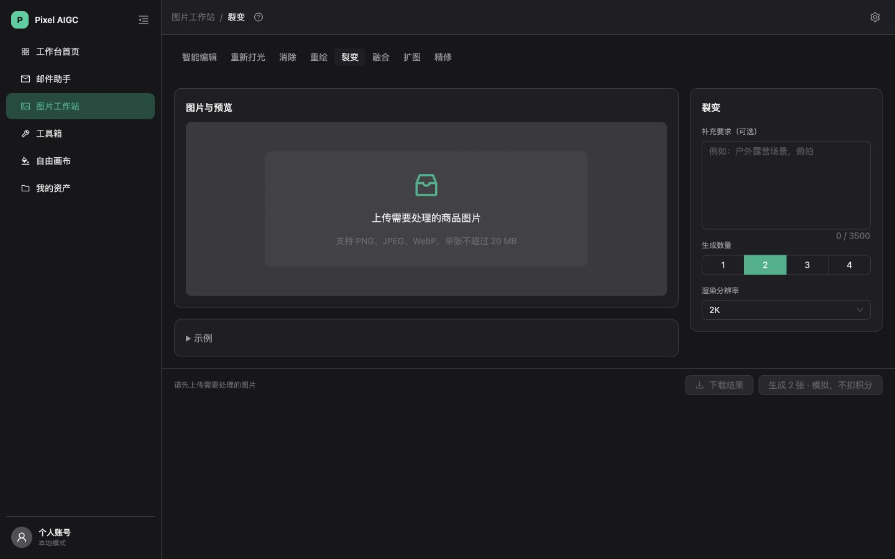
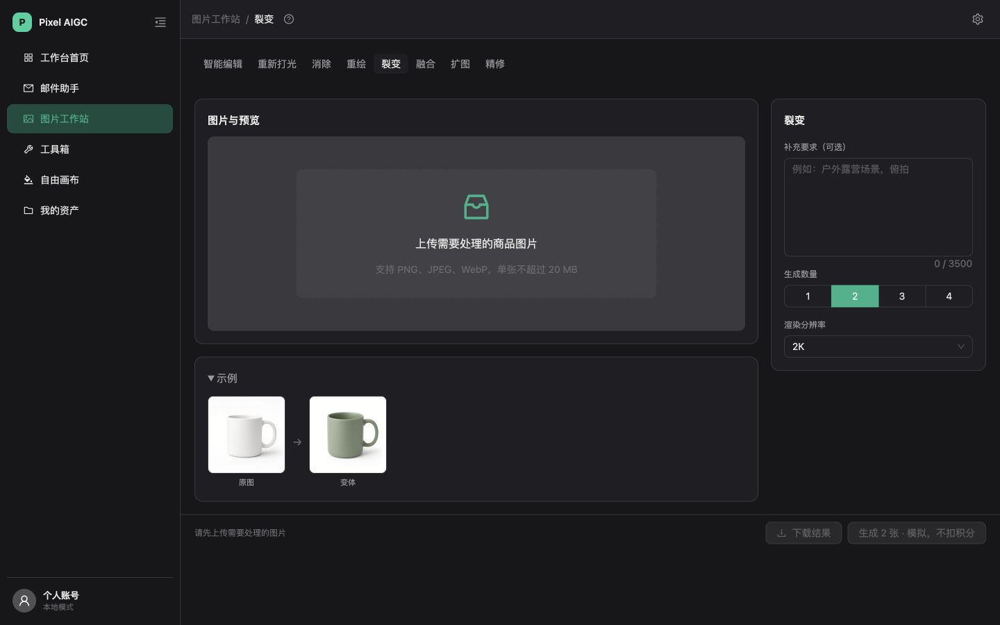
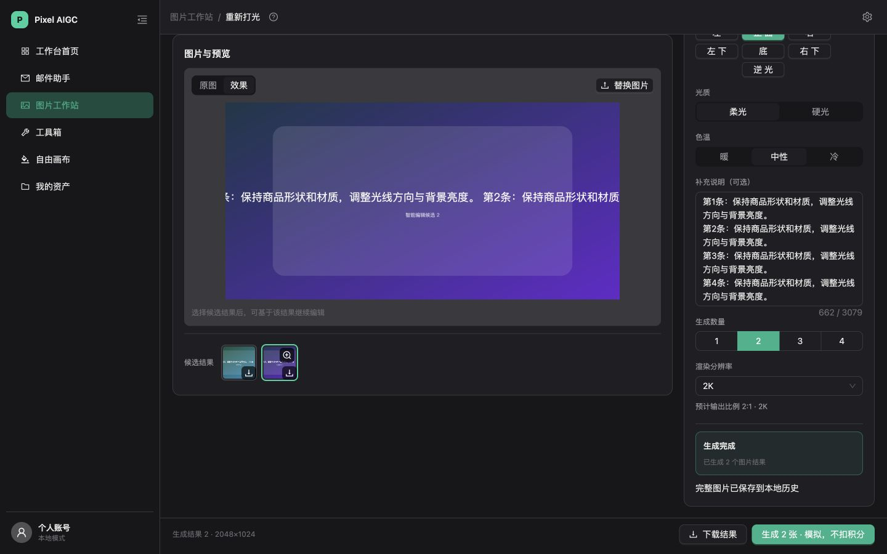
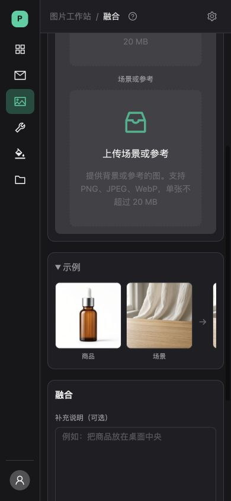

# 图片工作站卡片布局验收记录

日期：2026-10-11。分支：`codex/workstation-card-layout`。基于已同步的 `main`（`537cdc3`）。

## 实现内容

- 八个工具共用左右卡片：左侧图片操作与候选结果，右侧当前工具配置；桌面右栏310px、间距18px、最大宽度1440px。
- 裂变、融合示例独立放在左栏下方，保留默认展开和原生折叠；上传后按原规则隐藏。
- 上传后按实际可用高度判断左栏吸顶；窗口过矮或宽度不超过900px时恢复普通滚动。
- 工具栏进入正常布局，保留640×420逻辑画布及已有显示缩放机制。
- 桌面底部操作区吸底，统一包含生成、下载、报价、余额及结算提示；窄屏正常排列。
- 后端任务、模型、积分计算和生成请求接口沿用原实现。

## 自动验证

| 检查 | 结果 |
|---|---|
| 工作站页面与功能相关测试 | 20个测试文件、143项测试通过 |
| 构建及前后端类型检查 | `npm run build`通过 |
| 静态检查 | `npm run lint`通过 |
| 补丁检查 | `git diff --check`通过 |

新增测试覆盖八个工具共用卡片、示例独立布局及显隐、融合单张和双张输入、未上线工具的旧图隔离、吸顶高度边界、尺寸变化及观察订阅清理。既有控制器集成测试保留了生成、失败和恢复流程覆盖。测试日志没有未处理异常；控制器既有的React `act`警告仍存在。

## 浏览器验证

使用本地Vite页面，关闭云端与认证，启用模拟网关；上传文件均为自行构造的测试图片。

| 场景 | 验证结果 |
|---|---|
| 桌面示例展开、收起 | 右卡片始终为`x=1110、y=142、宽310、高392.125`；左栏高度从580.42降为433.14，没有挤压配置 |
| 1280×720长配置滚动 | 左卡片顶部两次均为56px，右卡片顶部从−155.5移动到−141px |
| 候选结果 | 两张模拟结果可切换选中、打开共用大图预览，并成功下载第二张PNG结果 |
| 1280×560短窗口 | 左卡片超过可用高度后取消吸顶，操作条保留，页面可继续滚动 |
| 901px与900px断点 | 901px为双栏；900px为单栏，左侧及操作区均正常滚动 |
| 390×844 | 主滚动容器宽度与滚动内容宽度均为322px；示例仅在自身图片行横向滚动 |
| 融合输入 | 零输入显示示例；仅上传参考图即隐藏；双图分别保留在商品与参考槽位 |
| 蒙版画布 | 画笔和橡皮擦可操作；撤销、重做正常；901px与390px下撤销记录保留；智能选区切换与提示正常 |
| 扩图 | 拖拽得到1359×604预计尺寸；调整窗口及收起、展开侧栏后尺寸保持 |
| 长名称 | 临时长名称文本使选择框自然增高到76px，页面没有横向溢出；测试后已还原文本 |
| 八个工具 | 均检查了图片卡片、配置卡片及单一配置标题 |

模拟网关当前返回SVG，现有图片校验拒绝读取，浏览器已确认其结果读取失败提示。成功结果流程使用临时适配将模拟SVG读取为PNG，验证完成后已恢复；没有修改应用代码的图片校验或调用真实付费生成服务。本记录证明本地布局和交互，不代表真实供应商生成验收。

完整尺寸记录见[布局测量数据](./layout-measurements.json)。

## 四类截图

桌面未上传，示例收起：

桌面示例展开：

上传及候选结果后左侧吸顶，右侧继续滚动：

窄屏融合示例独立排列：

